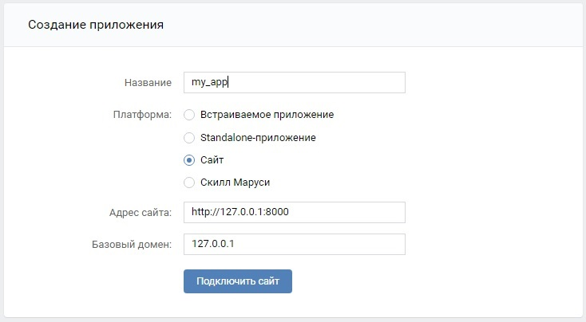
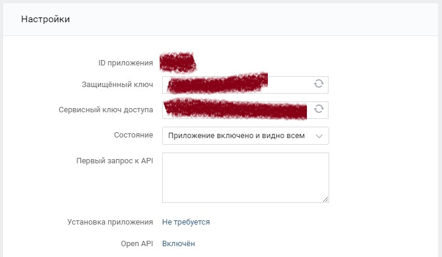

Веб-приложение OAuth2 авторизации через ВКонтакте и взаимодействия с соц.сетью
-
Установка
-

#### Создание приложения ВКонтакте
Создаем новое приложение на странице `https://vk.com/editapp?act=create`:


#### Настройка окружения
Все зависимости python-пакетов перечислены в файле `requirements.txt`. Установка осуществляется следующей командой: 
```commandline
pip install -r requirements.txt
```

Настройки подключения к БД, различные токены и прочие индивидуальные настройки проекта, которые не должны быть доступны 
публично, размещаются в файле `.env`. Для удобства в каталоге `animals` проекта находится файл `.env-default`, в котором
указаны необходимые для начального запуска константы.
```.env
# Секретный ключ приложения Django
DJANGO_SECRET_KEY=

# Режим отладки
DEBUG=True

# Строка подключения к БД
DATABASE_URL=

# ID приложения
SOCIAL_AUTH_VK_OAUTH2_KEY=

# Защищённый ключ
SOCIAL_AUTH_VK_OAUTH2_SECRET=

# Безопасный URI перенаправления
LOGIN_REDIRECT_URL=
```
_ID приложения и защищенный ключ указаны в настройках созданного приложения:_


Допустимо указать значения и переименовать файл в `.env`.

В конечном итоге файл настроек будет иметь подобный вид:
```.env
# Секретный ключ приложения Django
DJANGO_SECRET_KEY='fix7jnr*!8pfb9y!h&llmb=pu*c1_09f#e-5z!1rccdv=-y+sw'

# Режим отладки
DEBUG=True

# Строка подключения к БД
DATABASE_URL=sqlite:///emphasoft.db

# ID приложения
SOCIAL_AUTH_VK_OAUTH2_KEY=[ID_ВАШЕГО_ПРИЛОЖЕНИЯ]

# Защищённый ключ
SOCIAL_AUTH_VK_OAUTH2_SECRET=[КЛЮЧ_ВАШЕГО_ПРИЛОЖЕНИЯ]

# Безопасный URI перенаправления (за неимением большего - локальный сервер)
LOGIN_REDIRECT_URL=http://127.0.0.1:8000/
```

Применяем миграции:
```commandline
manage.py migrate
```